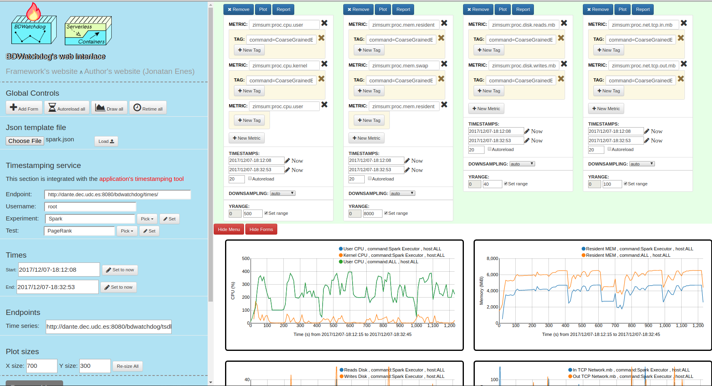
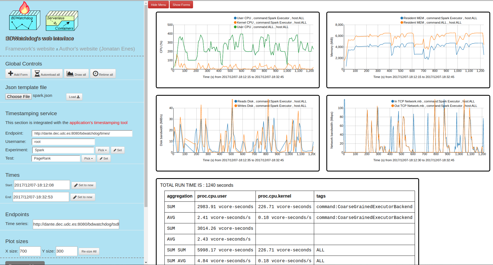

# Timeseries Viewer
This repository provides a web interface to easily plot resource 
time series and profiling flame graphs. You can try a version of it in 
this [website](http://bdwatchdog.dec.udc.es/BDWatchdog/TimeseriesViewer/demo.html).

### Download and install
```
git clone https://github.com/JonatanEnes/bdwatchdog
mv TimeseriesViewer /var/www/TimeseriesViewer
```
### Usage and examples

Once the interface has been downloaded and placed to be served, it can be used 
directly. This interface has been developed to be fully static and thus it
does not need any further deployment, it only needs a web server to, well, serve it.

### Screenshot 

<p align="center">
  
</p>

<p align="center">
  
</p>